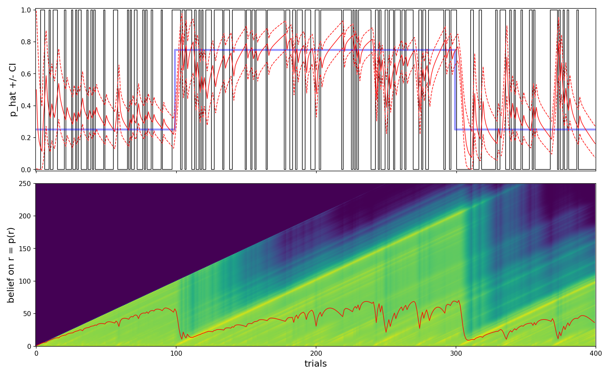

[](https://mybinder.org/v2/gh/laurentperrinet/bayesianchangepoint/master)

bayesianchangepoint
===================

An implementation of
[Adams &amp; MacKay 2007 "Bayesian Online Changepoint Detection"](http://arxiv.org/abs/0710.3742)
for a binomial input. In pure Python.

````
@TECHREPORT{ adams-mackay-2007,
AUTHOR = {Ryan Prescott Adams and David J.C. MacKay},
TITLE  = "{B}ayesian Online Changepoint Detection",
INSTITUTION = "University of Cambridge",
ADDRESS = "Cambridge, UK",
YEAR = "2007",
NOTE = "arXiv:0710.3742v1 [stat.ML]",
URL = "http://arxiv.org/abs/0710.3742"
}
````



* adapted from url='https://github.com/JackKelly/bayesianchangepoint', by Copyright 2013 Jack Kelly (aka Daniel) jack@jack-kelly.com
author='Jack Kelly', author_email='jack@jack-kelly.com'. This code is based on the beautifully commented
[MATLAB implementation](http://www.inference.phy.cam.ac.uk/rpa23/changepoint.php)
that was provided by Ryan Adams (no longer available online). http://hips.seas.harvard.edu/content/bayesian-online-changepoint-detection

* this code was used in the following publication: ["Humans adapt their anticipatory eye movements to the volatility of visual motion properties" (2020) by Pasturel, Montagnini and Prrinet](https://laurentperrinet.github.io/publication/pasturel-montagnini-perrinet-20/)

````
@article{PasturelMontagniniPerrinet20,
    title = {Humans adapt their anticipatory eye movements to the volatility of visual motion properties},
    journal = {PLoS Computational Biology},
    author = {Pasturel, Chloé and Montagnini, Anna and Perrinet, Laurent U},
    date = {2020-01-26},
    doi = {10.1101/784116},
    keywords = {motion anticipation},
    preprint = {https://www.biorxiv.org/content/10.1101/784116v2},
    url = {https://www.biorxiv.org/content/10.1101/784116v2},
    url_code = {https://github.com/laurentperrinet/PasturelMontagniniPerrinet2020},
    url_pdf = {https://www.biorxiv.org/content/biorxiv/early/2019/09/26/784116.full-text.pdf},
    year = {2020}
}
````

algorithm
---------

1. Initialize
 * $P(r_0)= S(r)$ or $P(r_0=0)=1$ and
 * $ν^{(0)}_1 = ν_{prior}$ and $χ^{(0)}_1 = χ_{prior}$
2. Observe New Datum $x_t$
3. Evaluate Predictive Probability $π_{1:t} = P(x |ν^{(r)}_t,χ^{(r)}_t)$
4. Calculate Growth Probabilities $P(r_t=r_{t-1}+1, x_{1:t}) = P(r_{t-1}, x_{1:t-1}) π^{(r)}_t (1−H(r^{(r)}_{t-1}))$
5. Calculate Changepoint Probabilities $P(r_t=0, x_{1:t})= \sum_{r_{t-1}} P(r_{t-1}, x_{1:t-1}) π^{(r)}_t H(r^{(r)}_{t-1})$
6. Calculate Evidence $P(x_{1:t}) = \sum_{r_{t-1}} P (r_t, x_{1:t})$
7. Determine Run Length Distribution $P (r_t | x_{1:t}) = P (r_t, x_{1:t})/P (x_{1:t}) $
8. Update Sufficient Statistics :
 * $ν^{(0)}_{t+1} = ν_{prior}$, $χ^{(0)}_{t+1} = χ_{prior}$
 * $ν^{(r+1)}_{t+1} = ν^{(r)}_{t} +1$, $χ^{(r+1)}_{t+1} = χ^{(r)}_{t} + u(x_t)$
9. Perform Prediction $P (x_{t+1} | x_{1:t}) =   P (x_{t+1}|x_{1:t} , r_t) P (r_t|x_{1:t})$
10. go to (2)
